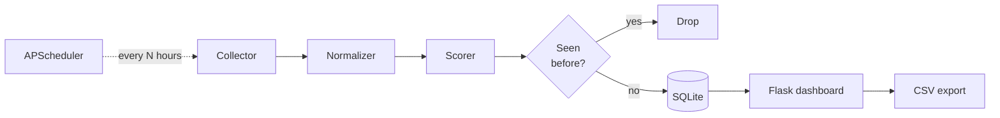

<p align="center">
  
</p>

<p align="center">
  
  
  
  
  
</p>

## Hey, I'm Mohid

I build automation and AI agents for back-office work.

Most of what I do starts the same way. Someone is doing a thing 200 times a month,
and they shouldn't be.

## Projects

### [Lead-Generation-Engine](https://github.com/M0hid-ai/Lead-Generation-Engine)

A lead qualification pipeline. It scores postings on buying intent using rules you
set in config, drops duplicates, stores everything in SQLite, and gives you a Flask
dashboard to triage from. The collector is kept separate from the rest of the
engine, so pointing it at a new source means changing two files.



`Flask` `APScheduler` `SQLite`

### Real Estate Lead Agent *(private)*

A CRM webhook fires, an LLM reads the lead, and a reply goes out over email or
WhatsApp. I ported it off a no-code platform once the per-operation billing stopped
making sense at volume.

`FastAPI` `Gemini` `WhatsApp Cloud API` `Docker`

## How I work

I lean on AI heavily, and the leaning is the easy part. A model will hand you
something shaped exactly like a working system, and the shape is not the system. So
I run it, test it, and read the diff before I believe any of it.

<details>
<summary>What that looks like in practice</summary>

<br>

The Lead-Generation-Engine ships a test suite that runs offline against a throwaway
database. No credentials, no network, sixty checks, about a second to run. It exists
because I once shipped a README describing eleven modules that did not exist yet.

```
python smoke_test.py
```

</details>

## Stack

Python · FastAPI · Flask · SQLite · Docker · Claude · Gemini · webhooks

---

<p align="center">
  <a href="mailto:mohid.fida@gmail.com">mohid.fida@gmail.com</a>
</p>
